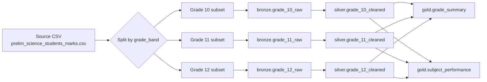
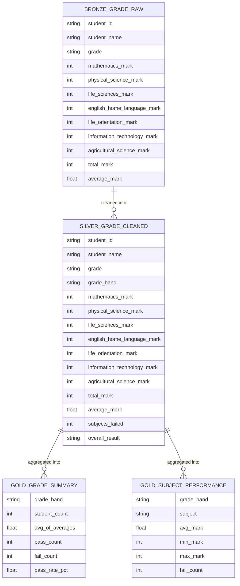

# Prelim Science Marks — Data Warehouse Project Spec

Source file: `prelim_science_students_marks.csv` (100 students, 7 subjects,
wide format). **This is the only file provided.** You split it and build
the layers yourself — nothing below is pre-built for you.

## Goal

Take the flat CSV and produce a Bronze → Silver → Gold warehouse, split
by grade band (10 / 11 / 12), following the Medallion Architecture.

---

## 1. Target pipeline (flow)

---

## 2. Target schema (per layer)

---

## 3. What each layer must do

### Bronze — raw, split, untouched
- Split the source CSV into 3 files/tables by grade band (10, 11, 12).
- No cleaning, no casting, no new columns — copy values as-is.
- Purpose: preserve exactly what was received, per grade, so any
  downstream bug can be traced back to unmodified source data.

### Silver — cleaned, typed, conformed
- Trim/title-case `student_name`.
- Cast all 7 subject marks to integers.
- Add `grade_band` (derived from `grade`, e.g. "10A" → "10").
- Derive `subjects_failed` = count of subjects with mark < 40.
- Derive `overall_result` = `"FAIL"` if `subjects_failed > 0` else `"PASS"`.
- Still split by grade band, one clean table per grade.

### Gold — aggregated, reporting-ready
- `grade_summary`: one row per grade band — student count, average of
  averages, pass count, fail count, pass rate %.
- `subject_performance`: one row per grade band × subject — average,
  min, max mark, and fail count for that subject.
- No row-level student detail at this layer — only aggregates.

---

## 4. What's expected of you

1. **Split the source CSV yourself** into 3 grade-band subsets — this is
   the point of the exercise, so no split files are provided.
2. **Build bronze**: land each grade subset as-is (no transformation).
3. **Build silver**: write the SQL/Python that produces the cleaned
   schema above from bronze — including the pass/fail logic, and be
   ready to justify the 40-mark threshold you use.
4. **Build gold**: aggregate silver into `grade_summary` and
   `subject_performance` using GROUP BY logic — don't compute these
   straight from the source CSV.
5. **Preserve grade_band lineage** end-to-end — no student should lose
   or change grade band between layers.
6. **Submit**: your split/load scripts, transformation scripts,
   aggregation scripts, the resulting tables, and a short note on any
   data quality issue you spotted (outlier marks, duplicate names, etc.)
   and how you handled it.

The diagrams above are the **target shape only** — you produce the
actual tables.
